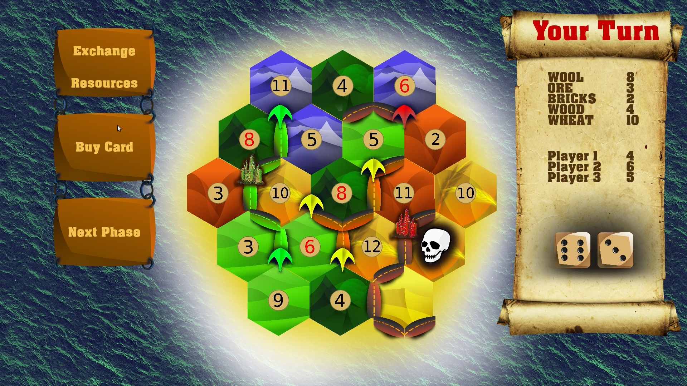

[](https://travis-ci.com/KaperD/HSE-C-Project--Settlers-of-Catan)
[](https://www.codacy.com/manual/KaperD/HSE-C-Project--Settlers-of-Catan?utm_source=github.com&amp;utm_medium=referral&amp;utm_content=KaperD/HSE-C-Project--Settlers-of-Catan&amp;utm_campaign=Badge_Grade)

## Компьютерная версия настольной игры «Колонизаторы»



### Об игре

«Колонизаторы» — пошаговая стратегическая игра для 2-4 игроков. Игроки могут получать и обменивать ресурсы, строить дороги и поселения, покупать и разыгрывать карты развития (специальные карты пяти видов, при розыгрыше которых происходит определенное событие). За строительство поселений или розыгрышь определённой карты развития игрокам начисляются очки, также 2 очка получает игрок, имеющий самую длинную дорогу. Побеждает игрок, которой первым наберёт 10 очков.

### О реализации

Наша игра имеет графический интерфейс, управление осуществляется с помощью компьютерной мыши. Можно играть по локальной сети или через интернет.

### Установка

Мы не нашли легкого способа установки всех необходимых библиотек для компиляции игры, однако смогли их прилинковать статически. Вы можете легко установить нашу игру с помощью deb пакета, который находится в папке ```Build```. Если ваша Linux система не поддерживает deb пакеты, то вы можете воспользоваться Docker.

#### Установка deb пакета

- ```$ sudo apt install ./Catan_1.1_amd64.deb``` — установить

- ```$ catan``` — запустить

- ```$ sudo apt remove catan``` — удалить

#### Docker

```
$ xhost local:root
$ sudo docker run -e DISPLAY=unix$DISPLAY -v /tmp/.X11-unix:/tmp/.X11-unix -it -v /dev/snd:/dev/snd --privileged ubuntu:18.04
$ apt-get update
$ apt-get install wget
$ cd home
$ wget https://github.com/KaperD/HSE-C-Project--Settlers-of-Catan/raw/cmake/Build/Catan_1.1_amd64.deb
$ apt install ./Catan_1.1_amd64.deb
$ catan
```

### Используемые библиотеки

- #### SDL2

- #### gRPC

- #### Protobuf